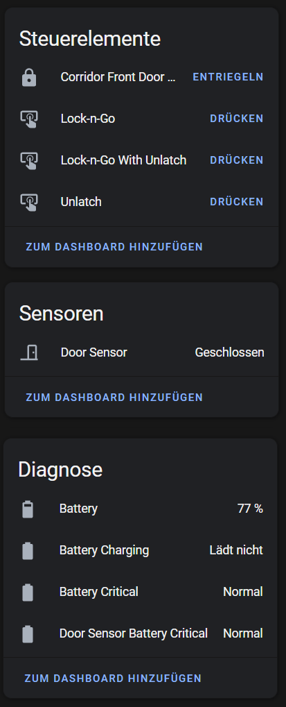

# Nuki MQTT auto. Discovery

[](https://www.home-assistant.io)
[](https://github.com/hacs/integration)

Python script for creating Home Assistant MQTT auto. discovery topics for a Nuki Smart Lock 3.0 Pro with enabled MQTT client. (currently only available in the beta firmware) Execute this script once to create a MQTT device with all necessary entities.

## Usage

Just copy the URL of this repository and add it under HACS --> Custom Repositories (Category: Python-Script)

### Paramters

| Parameter | Type | Required | Description | Example |
| ---- | :--: | :------: | ----------- | ------- |
| device_id | string | Yes | The device ID also known as Nuki Smart Lock ID. | 12345678 |
| device_name | string | Yes | The device name | Front Door Lock |
| device_model | string | Yes | The device model | Smart Lock 3.0 Pro |
| discovery_topic | string | No | The home assistant auto. discovery topic (Default: homeassistant) | homeassistant |
| door_sensor_available | boolean | No | If true, the door sensor data is also discovered (Default: false) | true |
| keypad_available | boolean | No | 	If true, the keypad data is also discovered (Default: false) | false |

### Example

```yaml
service: python_script.nuki_mqtt_discovery
data:
  device_id: 12345678
  device_name: Front Door Lock
  device_model: Smart Lock 3.0 Pro
  discovery_topic: homeassistant
  door_sensor_available: true
  keypad_available: false
```

### Home Assistant Device

